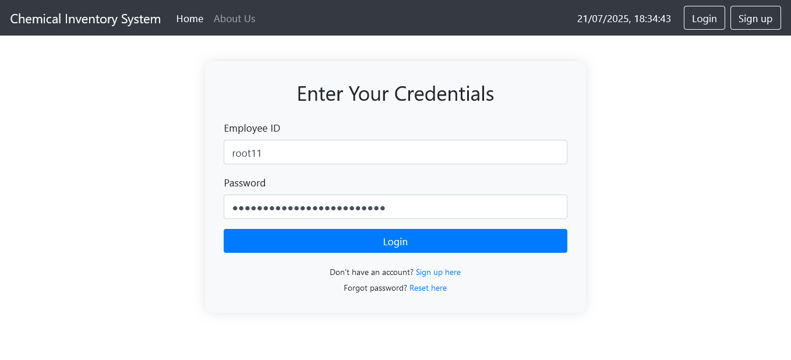
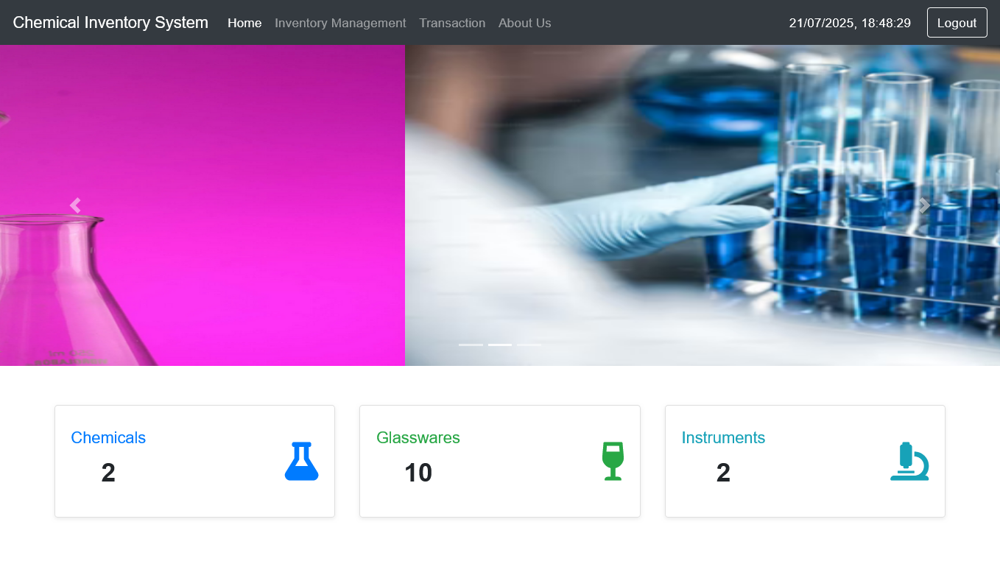

# 🧪 Chemical Inventory Management System

## 👨‍🎓 Developed By:
**Deepak Misal**
🔗 [LinkedIn Profile](https://www.linkedin.com/in/deepakmisal24/)  

---

## 📌 Description
This project is a lightweight and user-friendly **Chemical Inventory Management System** designed for managing chemical, glassware, and instrument stock in laboratories. Built using **PHP, MySQL, and Bootstrap**, it allows authenticated users to add, update, delete, and view inventory records efficiently and also supports partial updates, derived field calculations and session-based transaction logging. Deployed using the **XAMPP** stack (**Apache**,**MySQL**, **PHP**).

---

## 🚀 Features
- 🔍 View inventory of Chemicals, Glassware, and Instruments
- ➕ Add new inventory entries
- ✏️ Update existing entries with partial field updates
- 🗑️ Delete inventory records based on unique identifiers
- 🧮 Automatically calculates derived fields like `available`, `working`, etc.
- 🔐 Transaction logs for every action
- 🎨 Bootstrap-based responsive UI

---

## 🛠️ Tech Stack
- **Frontend**: HTML, CSS, Bootstrap
- **Backend**: PHP
- **Database**: MySQL
- **Server**: Apache (XAMPP)

---

## 📁 Folder Structure
```
C:/xampp/htdocs/chemical_inventory_system/
│
├── welcome.php
├── inventory_form.php        # Add items
├── inventory_update.php      # Update items
├── inventory_delete.php      # Delete items
├── inventory_management.php  
├── inventory_view.php        # View inventory
├── login.php
├── logout.php
├── signup.php
├── transaction.php           # All the activities performed
├── forgotpswd.php            # Reset password
├── aboutus.php
│
├── partials/
│   ├── _dbconnect.php
│   ├── style.css
│   └── _nav.php
│
└── images/
    ├── slide1.png
    ├── slide2.png
    └── slide3.png
 ```

---

## ⚙️ Installation Instructions

1. 🔽 Download or clone the project.
2. 🧰 Install and open **XAMPP**.
3. 🟢 Start **Apache** and **MySQL** from the XAMPP control panel.
4. 📂 Move the project folder into the mention directory
5. 🛢️ Open **phpMyAdmin** and:
- Create a database named `chemistry`
- Import the required SQL tables (`chemicals`, `glassware`, `instrument`, `signin`, `transactions`)
6. 🔧 Open `partials/_dbconnect.php` and update your database credentials (if needed).
7. 🌐 Launch your browser and go to:
    ```http://localhost/chemical_inventory_system/welcome.php```

## 🗃️ Database Tables
1. chemicals
2. glassware
3. instrument
4. signin
5. transactions
> 

## 📸 Screenshots
> 
> 
> 

## 💡 Future Improvements
1. Role-based login (Admin, Lab Assistant, Faculty)
2. Two-factor authentication for better security
3. Password strength meter and reset link via email
4. Barcode/QR code scanner for item tracking
5. Export inventory to PDF, Excel
6. Integration with lab equipment or sensors
